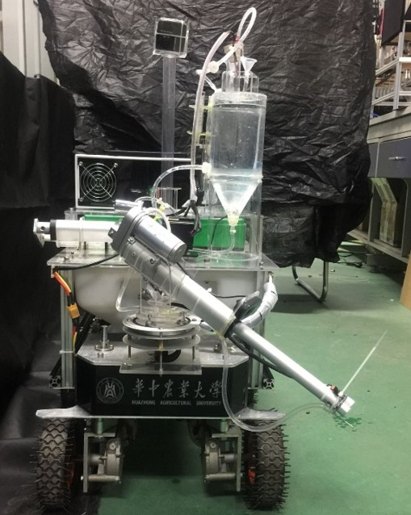

针对大棚植株中施肥量控制不均匀，施肥对象不明确，施肥精度无法控制等问题，提出本解决方案，以满足现代农业精准施肥的需求，

本项目设计并制作了一种电驱动自走式变量施肥机器人。该机器人通过机械臂前端双目摄像头对植株叶片颜色进行图像分析，从而确定不同植株的生长情况。同时，机器人顶部储液罐可实现无机盐快速混合和配比。最终通过机械臂末端喷嘴将肥液喷射在植株根部，便于吸收。

本项目通过结合互联网+、自动控制、机器视觉、图像传输等多项技术，该机器人可实现自动导航、路径规划，以及对植株根部精确对靶施肥。

施肥量误差 < ±5 ml,工作续航: 4 h

<big>本装置获得第三届全国大学生只能农业装备创新大赛特等奖</big>

团队成员：钟林君、陈文峰、蒋嵚

授权专利：基于STM32的自走式盆栽变量施肥机器人.CN201720963269.9