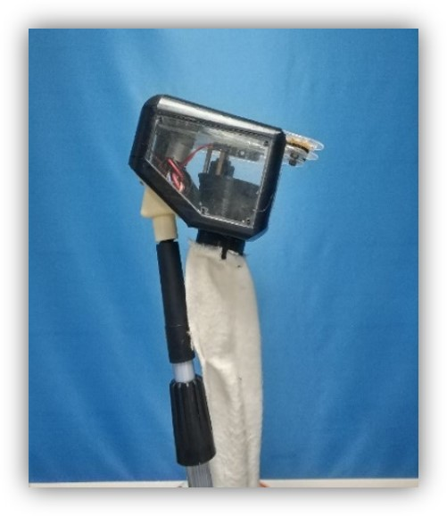

针对砂糖橘（一种小型柑橘，直径：3-5 cm）采摘过程中存在的残余果梗过长、表皮易损伤、采摘过程劳动强度大等问题，提出相应的解决方案。

本装置主要由同步带夹持机构和果梗切割机构组成:

  1.同步带夹持机构采用两条齿形相对的同步带组成，同步带齿距与砂糖橘果梗粗细相匹配（4 mm),从而将柑橘果梗及果实拉扯进装置腔体中。腔体内具有顺形机构，可保持果实移动过程中其末端紧贴在顺形机构底部。

  2.果梗切割机构由手术割刀和高速无刷电机组成。当果实移动到相应位置时，将触发内部红外感应传感器，切割刀将高速旋转，从而将果梗割断。最终柑橘果实通过布制输果管落入底部果筐中。

顶端的果实采集装置结构紧凑（长X宽X高：15 cm X 10 cm X 15 cm），通过下端连接的伸缩杆可采集1-2 m范围内的果实。

装置总质量：3kg，续航时间：2 h,实际采集效率：1 分钟/果.

本装置仅为概念模型，用于实际生产使用可根据装置进行相应材料和尺寸调整。

*本装置获得第八届全国大学生机械创新设计大赛（湖北赛区）一等奖*

*团队成员：蒋嵚、钟林君、张宏伟、肖振威、何璇*

*授权专利：一种高效柑橘辅助采摘装置.CN201820849215.4*